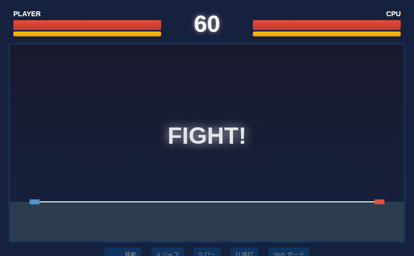

# Silent Kill

Top-down 2D stealth assassination game built with vanilla HTML/CSS/JavaScript.

## Play

[Play Online](https://rsasaki0109.github.io/silent_kill/)

## Controls

| Key | Action |
|-----|--------|
| W/A/S/D | Move |
| Space | Assassinate |
| R | Retry |

## Rules

- Avoid enemy vision cones (red areas)
- Approach enemies from behind
- Player turns green when in kill range
- Press Space to eliminate the target
- All enemies eliminated = Stage Clear

## Features

- 5 progressive stages
- Enemy patrol AI with vision cones
- Line-of-sight blocking with walls
- Minimal dark UI design
